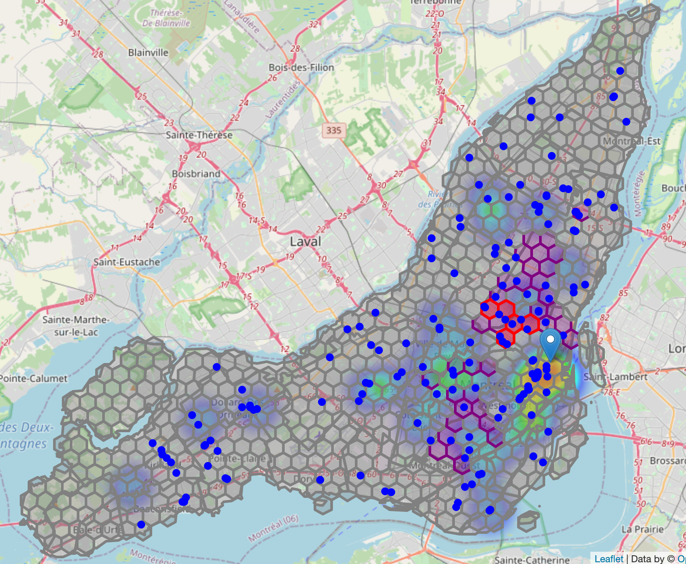

# Coursera_Capstone
Capstone Project for IBM Data Science Professional Certificate

## Open a Movie Theater in Montreal

towards data science:  
 [The Battle of the Neighborhoods — Open a Movie Theater in Montreal](https://towardsdatascience.com/the-battle-of-the-neighborhoods-open-a-movie-theater-in-montreal-355cf5c679b8)

Complete Jupyter Notebook Output in NbViewer:  
[Capstone Project - Open a Movie Theater in Montreal (nbviewer)](https://nbviewer.jupyter.org/github/kyokin78/Coursera_Capstone/blob/project/CapstoneProject_OpenCinemaInMontreal.ipynb)

Github original Juypter Notebook view:  
[Capstone Project - Open a Movie Theater in Montreal](https://github.com/kyokin78/Coursera_Capstone/blob/project/CapstoneProject_OpenCinemaInMontreal.ipynb)

